```{r setup, include=FALSE}
knitr::opts_chunk$set(echo = TRUE)
```

## Introduction


### At A Glance

{accessrmd} is currently in development. If you discover bugs or improvements, 
please review the
[code of conduct](https://github.com/datasciencecampus/accessrmd/blob/main/CODE_OF_CONDUCT.md)
and [contribute on GitHub](https://github.com/r-leyshon/access_rmd_docs/issues).

{accessrmd} is a package written to help improve the accessibility of Rmarkdown
documents. The standard Rmarkdown outputs have HTML structural issues that
result in problems for people using screen readers. The purpose of {accessrmd}
is to help developers in writing accessible Rmarkdown documents and in
converting a back catalogue of documents in need of accessibility amendments.

{accessrmd} is currently limited to `html_output` only. It is not available on
CRAN yet, but this is the aim once the first release has been published.

To install the development version:

```{r, message=FALSE}
devtools::install_github("datasciencecampus/accessrmd")
```

To attach the package:

```{r, message=FALSE}
library(accessrmd)
```


***

### What problem does it solve?

The HTML structure of standard rmarkdown outputs are not AA
[WCAG2.1 standard](#wcag). AA is the standard
required by all
[UK government digital services](#ukgov). In order to present HTML checks, I
will be enlisting the help of the excellent, open-source
[WAVE accessibility tool](#wave). It doesn't catch everything required for
AA-compliance, but it's a great way to get started with an accessibility audit,
including helpful explanations for newcomers to WCAG 2.1 compliance.

The below image shows the output of a WAVE check on the standard Rmarkdown html
output. As you can see, there are a number of errors and warnings. Click the
image for more detail.

<a href="https://wave.webaim.org/report#/https://datasciencecampus.github.io/accessrmd/tests/testfiles/test.html" target="_blank">
  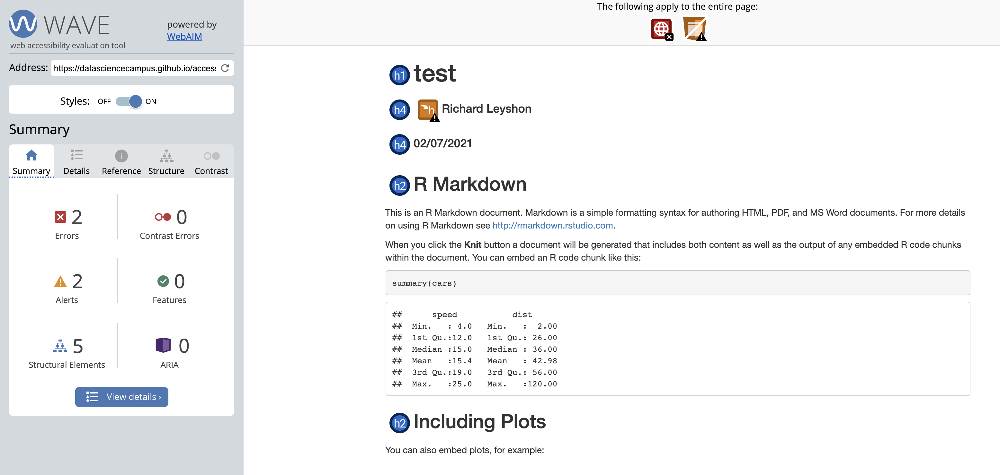
</a>
Click the image to view the full check on wave.webaim.org, opens in new window.

By executing a few functions from the {accessrmd} package, the html format
issues can be easily remedied, without the developer needing to write any HTML.
Please observe the output of an Rmarkdown which has been adjusted by {accessrmd}
functions (again, you can click for an interactive check):

<a href="https://wave.webaim.org/report#/https://datasciencecampus.github.io/accessrmd/tests/testfiles/accessrmd/test.html" target="_blank">
  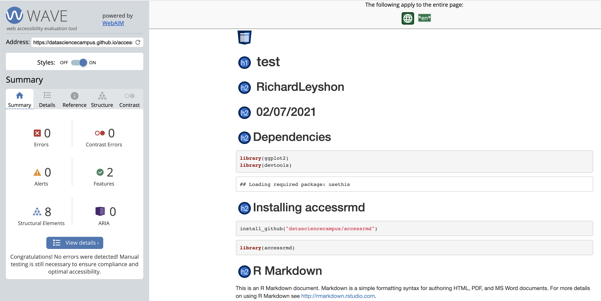
</a>
Click the image to view the full check on wave.webaim.org, opens in new window.


***

## Functions Gallery

In this section, I will be working with a test Rmarkdown document. It contains
a simple ggplot chart and a test image. [Click to see the test Rmarkdown output](docs/test.html).

[Click to see the WAVE check](https://wave.webaim.org/report#/https://r-leyshon.github.io/access_rmd_docs/docs/test.html). Note the errors and warnings.

The issues are caused by the HTML structure and YAML settings. The YAML
currently looks like this:

```{r, comment=NA}
lines <- readLines("test.Rmd")
message(paste(lines[1:6], collapse = "\n"))

```


### `access_head()`

Reads an Rmd file, converting the YAML header to a format that is screen-reader
friendly.

### `access_img()`

Reads in an image and produces the HTML structure expected by web accessibility
checkers such as WAVE. Also works as a wrapper around {ggplot2} charts.

### `check_alt_len()`

In development.

### `detect_html_lang()`

In development.

### `find_all_alts()`

In development.

### `find_all_imgs()`

**Not exported.** Find any markdown or HTML syntax images within read lines.
Check any lines for images and return the line numbers and values.

### `handle_rmd_path()`

**Not exported.** Helper function.Checks rmd_path exists and that the file
type is as expected.

### `sus_alt()`

Suspicious alt text - checks if an image's alt text is equal
to alt attribute placeholder values, including 'nbsp', 'spacer' and the src
attribute value (filename).

***

## Github Actions{.tabset}

A continuous deployment workflow has been employed in the development of
{accessrmd}, using [GitHub Actions](https://github.com/features/actions).

This workflow has allowed efficient adaptation of the package modules while
ensuring the integrity of the outputs and conditional behaviours.

CD workflows for this package include:

* CRAN build checks.
* Test coverage with [Codecov.](https://app.codecov.io/gh/datasciencecampus/accessrmd)
* Automated linting.

***

### R CMD Build Check
[](https://github.com/datasciencecampus/accessrmd/actions)

An automated test suite analagous to the checks run by [CRAN](#cran) on package
submission. 

This suite of checks is something that I tend to  execute as part of my
development practice. However, setting automated checks on push to the remote
ensures that human error is mitigated. Collaborators or developers wishing to
install the development version of {accessrmd} can be informed of the
current state of the repository and assured of the package's functionality.

As can be seen from the screenshot below, the package is tested for
compatibility with three different operating systems, Windows, MacOS and 2
flavours of Ubuntu.

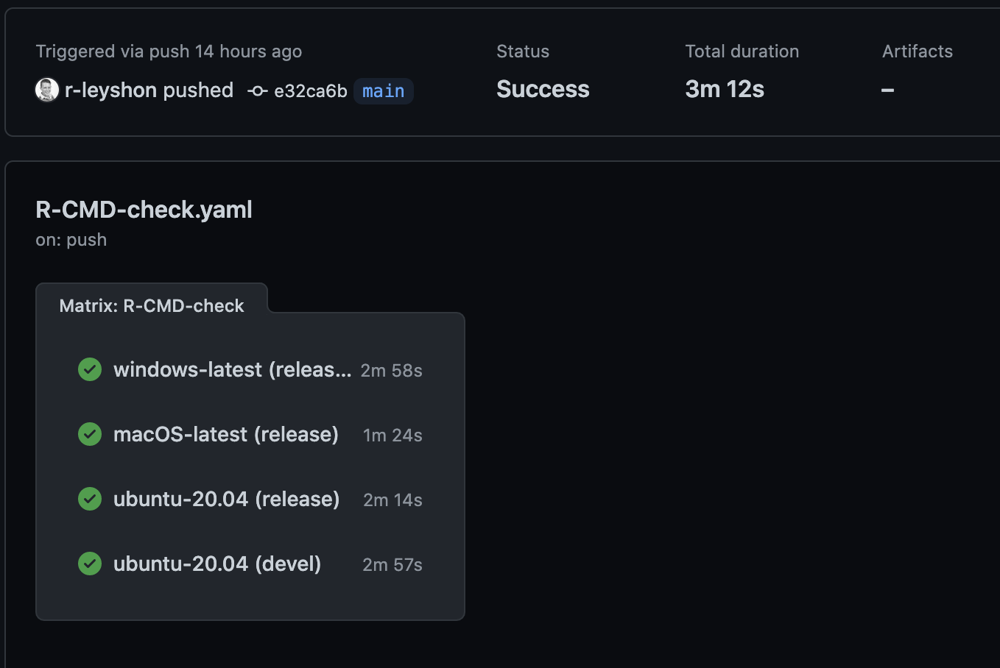

Clicking on an item in the check manifest allows you to view the detailed check
schedule. If any checks failed, you can consult the log to help pinpoint the 
error.

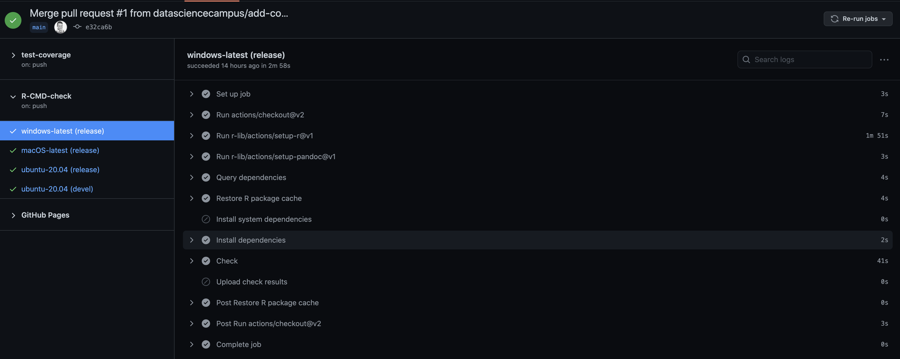

***

### Test Coverage With Codecov


I utilise Test-Driven Development when writing software in order to mitigate
against misuse cases.

<blockquote class="tiktok-embed" cite="https://www.tiktok.com/@tired_actor/video/6912855387788102918" data-video-id="6912855387788102918" style="max-width: 605px;min-width: 325px;" > <section> <a target="_blank" title="@tired_actor" href="https://www.tiktok.com/@tired_actor">@tired_actor</a> <p><a title="duet" target="_blank" href="https://www.tiktok.com/tag/duet">##duet</a> with @brock1137 no please no <a title="funny" target="_blank" href="https://www.tiktok.com/tag/funny">##funny</a> <a title="welcome2021" target="_blank" href="https://www.tiktok.com/tag/welcome2021">##Welcome2021</a> <a title="2021" target="_blank" href="https://www.tiktok.com/tag/2021">##2021</a> <a title="newyear" target="_blank" href="https://www.tiktok.com/tag/newyear">##newyear</a> <a title="firstpost" target="_blank" href="https://www.tiktok.com/tag/firstpost">##firstpost</a> <a title="viral" target="_blank" href="https://www.tiktok.com/tag/viral">##viral</a> <a title="fyp" target="_blank" href="https://www.tiktok.com/tag/fyp">##fyp</a> <a title="foryou" target="_blank" href="https://www.tiktok.com/tag/foryou">##foryou</a> <a title="foryoupage" target="_blank" href="https://www.tiktok.com/tag/foryoupage">##foryoupage</a> <a title="comedy" target="_blank" href="https://www.tiktok.com/tag/comedy">##comedy</a> <a title="crying" target="_blank" href="https://www.tiktok.com/tag/crying">##crying</a> <a title="2020" target="_blank" href="https://www.tiktok.com/tag/2020">##2020</a> <a title="rareaesthetic" target="_blank" href="https://www.tiktok.com/tag/rareaesthetic">##RareAesthetic</a></p> <a target="_blank" title="♬ The Square Hole - Brock" href="https://www.tiktok.com/music/The-Square-Hole-6912243937592068869">♬ The Square Hole - Brock</a> </section> </blockquote> <script async src="https://www.tiktok.com/embed.js"></script>

All jokes to the side, ensuring that your functions are safe is vital. This
helps mitigate against poor documentation and misinterpretation.

>Code coverage gives an indication of the percentage of code lines that are
exercised when the test battery is run. However, I would advise caution in
assuming that a high coverage equates to quality software. It tends to be very
easy to write a suite of tests that result in high coverage. This does not mean
that all necessary exception handling has been considered and tested.

Thorough and well-considered test conditions are excellent tools in assuring
quality software. It also means that you can turn your failures into future
successes - every bug you encounter can be converted to a meaningful test.

Below, you can view the test coverage workflow on pushing to the remote.

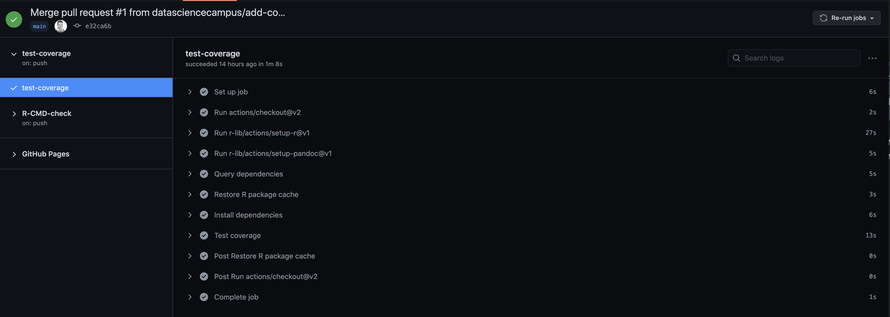


### Linting

Automated linting using the {lintr} package with GitHub actions is used to help
ensure code adheres to the tidyverse style guide. Code readability is important
in assisting collaboration. Data Science Campus guidance is to apply the
[tidyverse style guide](#tidstyle).

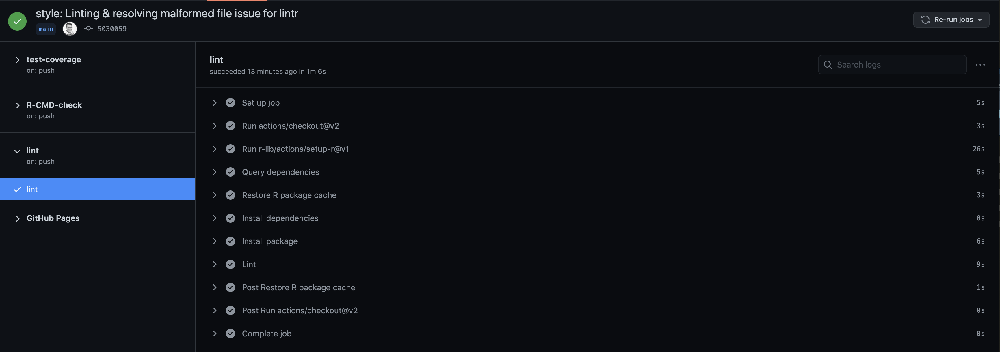

Perhaps more important than the adopted style is to ensure that code is
conscientiously commented. Your colleagues and future self will value the effort
taken in explaining your code.

## {.unlisted .unnumbered .toc-ignore}

***

## More Projects By The Author


### GitHub Projects{.tabset}

#### 'ptspotter' Package

[](https://CRAN.R-project.org/package=ptspotter) [](https://github.com/r-leyshon/ptspotter/actions) 
[](https://r-pkg.org/pkg/ptspotter)

'ptspotter' is a package that aims to simplify some of the mundane tasks
involved in setting up an analytical pipeline using the fantastic [ProjectTemplate](http://projecttemplate.net/) framework.

[ptspotter is available on CRAN.](https://cran.r-project.org/package=ptspotter)

[ptspotter blog.](https://r-leyshon.github.io/ptspotter_blog/)

***

#### Highways England Traffic Data

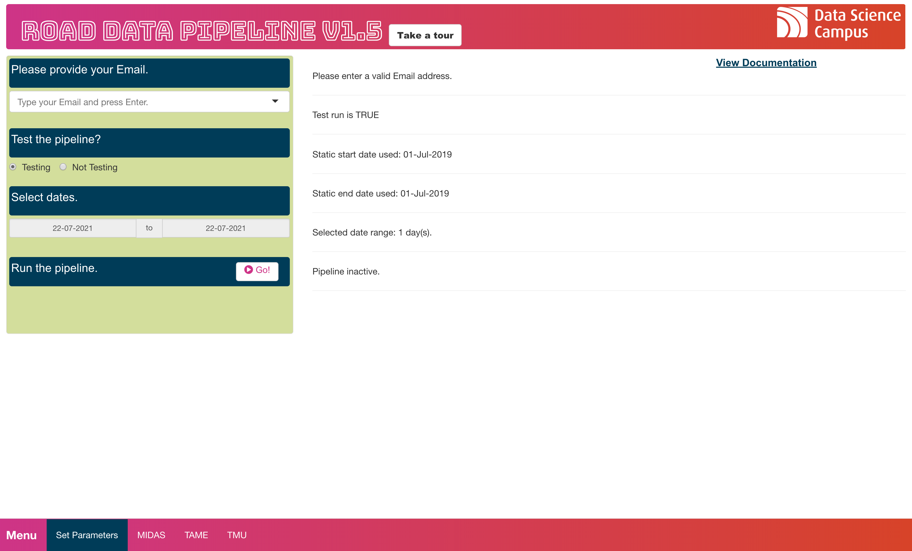


This data pipeline was redeveloped in December 2020 as Brexit approached. It has
been an important source of road sensor data to help inform the movement of
traffic around English ports. This redevelopment was requested by the faster
economic indicators team and the Chief Economist.

The redeveloped pipeline features the querying of the Highways England RESTful
webTRIS api in parallel using a virtual environment. Additional value beyond the
MVP was added with a Shiny UI to add data validation and an automated Rmarkdown
report, adding insight on the proportion of site types returning null responses.

[Code on GitHub](https://github.com/datasciencecampus/road-data-dump/tree/r-pipeline)

[Documentation on GitHub Pages](https://datasciencecampus.github.io/road-data-pipeline-documentation/)

***

#### DSC GitHub Scrape

[Code on GitHub](https://github.com/r-leyshon/DSCA_course_catalogue_dev)

In the Summer of 2020 I had been assigned to develop a solution that would
ensure the team's external website reflected the course status on GitHub. As
there was much activity in course QA in our backlog, the status of our website
would become out of date often.

The pipeline I developed interacts with the GitHub REST API to return all
company repositories prefixed with "DSCA_" (capability repositories). In
collaboration with the campus faculty, I developed a standardised readme for all
courses that required metadata fields could be scraped from. 

The resulting table of course repos and metadata is cached on a monthly basis
to rds. This is then used to detect changes in course catalogue state. If
the number of course repos changes or a course version is incremented, an
automated Email using the Gmail API is sent to our internal comms team with a
summary of the change and an attached csv file including the updated course
catalogue. This routine is scheduled on a monthly basis using cron.

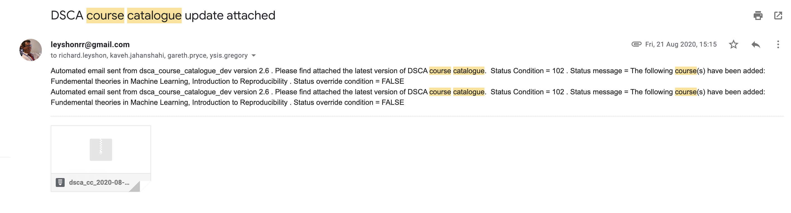


***

### {.unlisted .unnumbered .toc-ignore}

### Shiny Applications{.tabset}

These applications are presented in reverse order of publication. While the
contexts of the applications vary, they help to illustrate an increasing
maturity in Shiny development.

#### Earth Observation Wildfires

I am currently involved in a project with DSC colleagues in remote sensing
wildfires. We all attended the Summer 2021 NASA advanced remote sensing training
and have started development in Python & R, identifying & classifying fire
risk from satellite rasters.

In order to assist the team's exploratory work and model evaluation, I have
written an app that allows the developer full control over the [NASA Fire
Information for Resource Management System (FIRMS)](#firms) API. The application
uses authenticated HTTP requests via Web Map Service standard to ingest FIRMS
tiles. 

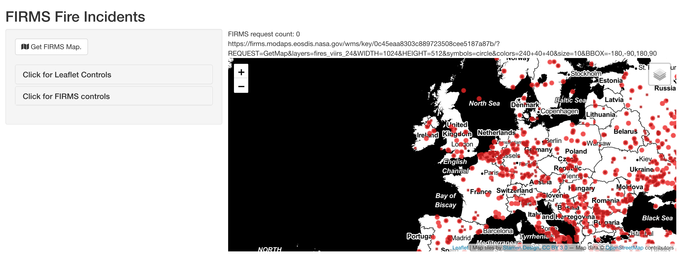

The developers can use the various inputs available within the collapsible
panes to adjust the query parameters, updating the API response
and adjusting the resultant map appearance.

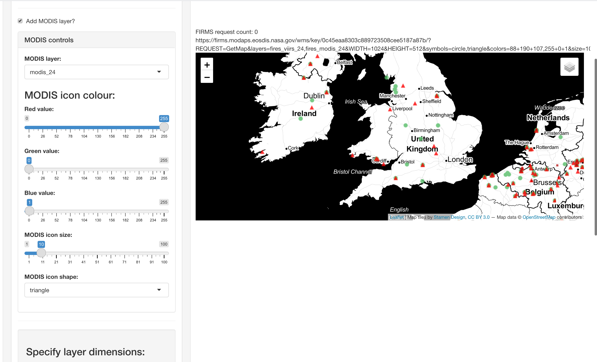


#### Unifyr

This is an educational application designed to help trainee data scientists in
developing their understanding of the different data join functions available
within the {dplyr} package. Unifyr allows the learner to select subsets from the
well-known gapminder dataset and observe the output of specified join functions.

<a href="https://richleysh84.shinyapps.io/UnifyR/" target="_blank">
  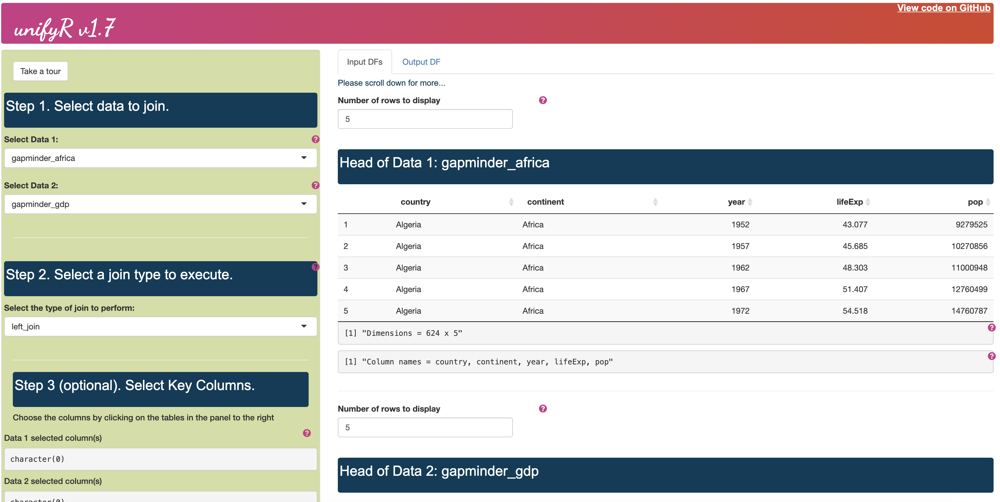
</a>
Click the image to see Unifyr on shinyapps.io, opens in new window.

***

#### Google Mobility Data

This Google Mobility Data application was developed at the start of the Covid-19
pandemic using data derived by the optical processing of pdf data publications.

The application allows the user to select specified local authority or NHS
bodies in order to view the time series mobility data.

<a href="https://richleysh84.shinyapps.io/uk_all_trends/" target="_blank">
  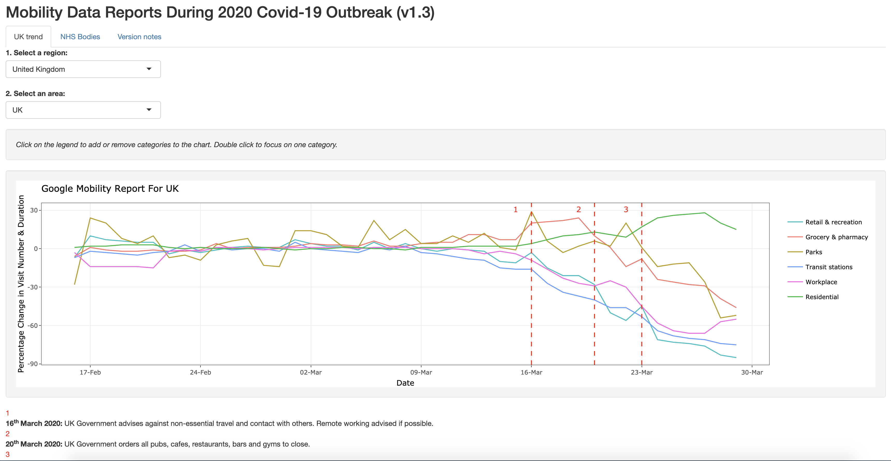
</a>
Click the image to see Google mobility data on shinyapps.io, opens in new
window.

***

#### Welsh School Funding

This application combines 2 open datasets published by Welsh Government:
Budgeted educational revenue and outturn expenditure. The available data
dimensions may be selected from to plot upon the chart axes by educational
phase. Time series data for all available schools and data dimensions may also 
be viewed upon the second tab. 

<a href="https://richleysh84.shinyapps.io/education_combined_scatter_v3/" target="_blank">
  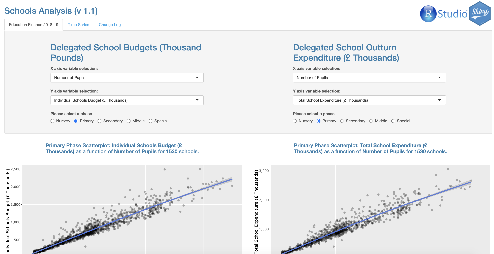
</a>
Click the image to see Welsh school funding data on shinyapps.io, opens in new
window.


***

#### Common Welsh Place Names

This app was a bit of fun and took very little time. It used some basic language
processing and geolocation to plot Welsh location names with common prefixes 
such as "Cwm" or "Aber" on a map. The application used open data published by
the Welsh Language Commissioner who subsequently approached me and were very
interested in the project, leading me to sharing the codebase with them.

<a href="https://richleysh84.shinyapps.io/common_placenames/" target="_blank">
  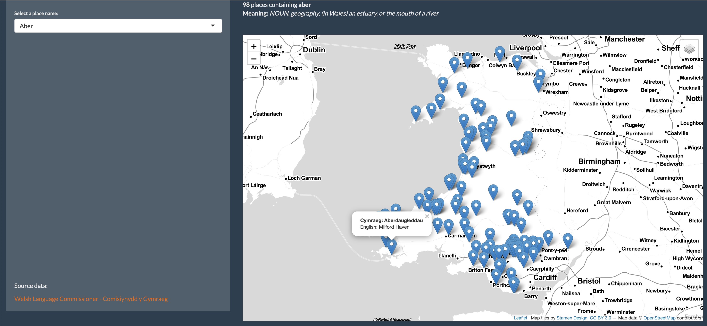
</a>
Click the image to see common Welsh place names on shinyapps.io, opens in new
window.

***

#### Cardiff Tide Levels

This repo visualises LiDar altitudinal data of Cardiff, openly published by
Natural Resources Wales. Cardiff was selected due to comparatively high data
quality and population density. The visualisations compare current day high tide
altitude with a modelled 2 metre sea rise by the year 2100.

<a href="https://richleysh84.shinyapps.io/cardiff_maps/" target="_blank">
  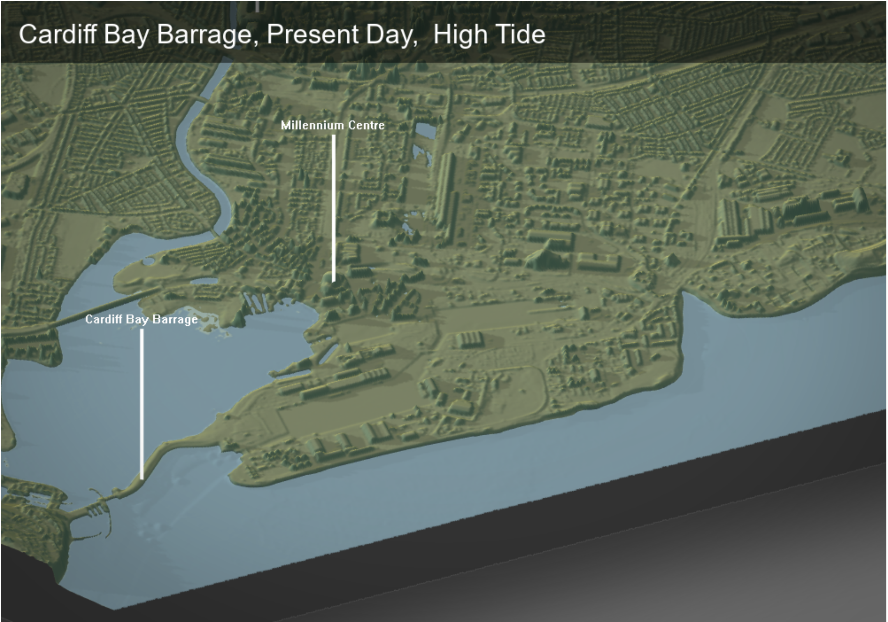
</a>
Click the image to see common Cardiff high tide levels on shinyapps.io, opens in
new window.

***

### {.unlisted .unnumbered .toc-ignore}

### RPubs{.tabset}

#### Remote Sensing Trees

In 2018 I had been approached by a colleague to discuss the feasibility of using
satellite data to help estimate the quantity of woodland stock in a defined
rural area. The report documents my exploration work done in this area using
open source geospatial frameworks and satellite rasters. The work pointed to 
a promising avenue of analysis but also indicated limitations in the use of open
source landsat imagery. At the time I recommended the procurement of higher
resolution remote imagery and verification of tree counts using ground truth
observational work.

<a href="https://rpubs.com/M_Merciless/trees_from_space" target="_blank">
  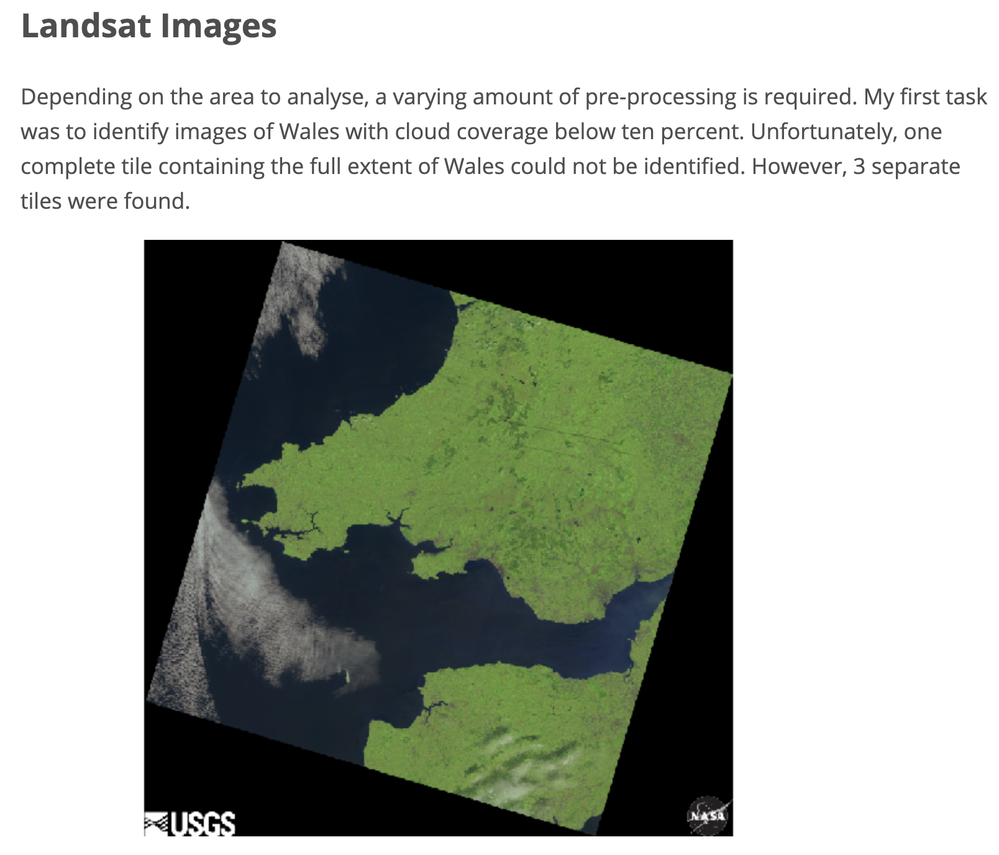
</a>
Click the image to see the counting trees from space exploratory report on
RPubs, opens in new window.

***

#### Welsh Schools Funding '18/19

This {flexdashboard} user interface was one of my first pieces of work in
application development. The dashboard is an adapted RMarkdown output and can 
very easily be reproduced with some basic data manipulation and markdown syntax.
Furthermore, the product is self-contained and can be Emailed and freely shared,
unlike a Shiny application which requires a connection to R and a shiny server.

The dashboard presents Budgeted Education Revenue for financial years 2018/19.
An interactive map of geolocated schools in Wales is presented with informative
tooltips highlighting the data dimensions. In additional tabs, linear regression
models of pupil numbers against delegated budgets for each educational phase are
presented.

<a href="https://rpubs.com/M_Merciless/wales_sch_funding1819" target="_blank">
  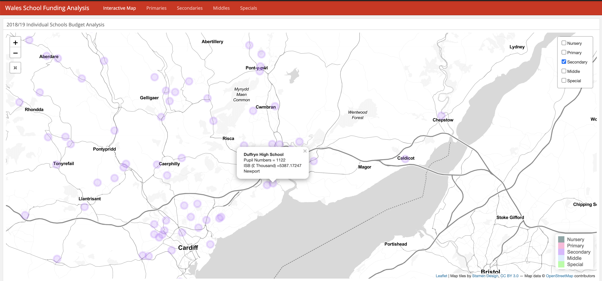
</a>
Click the image to see the Welsh school funding dashboard on RPubs, opens in new
window.

***

### {.unlisted .unnumbered .toc-ignore}

***

## Sources

<a id="cran" href="https://cran.r-project.org/web/packages/submission_checklist.html" target="_blank">Checklist for CRAN submissions</a>
<br>
<br>
<a href="https://earthdata.nasa.gov/earth-observation-data/near-real-time/firms" target="_blank">NASA Fire Information for Resource Management System</a>
<br>
<br>
<a id="tidstyle" href="https://style.tidyverse.org/" target="_blank">Tidyverse Style Guide</a>
<br>
<br>
<a id="ukgov" href="https://www.gov.uk/service-manual/helping-people-to-use-your-service/understanding-wcag" target="_blank">UK government digital services</a>
<br>
<br>
<a id="wave" href="https://wave.webaim.org/" target="_blank">WAVE Web Accessibility Evaluation Tool</a>
<br>
<br>
<a id="wcag" href="https://www.w3.org/WAI/WCAG21/quickref/" target="_blank">WCAG2.1 standard Quick Reference</a>
<br>