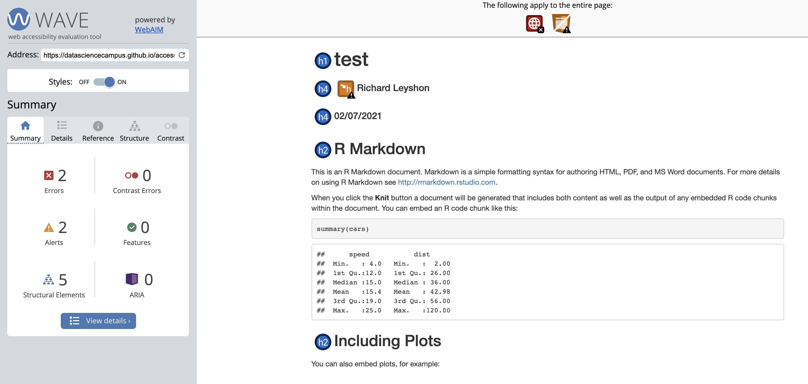

```{r setup, include=FALSE}
knitr::opts_chunk$set(echo = TRUE)
knitr::opts_chunk$set(comment = NA)
# allow duplicate chunk names for multiple renders of anon chunks
options(knitr.duplicate.label = "allow")
library(accessrmd)
```


## Contributing

{accessrmd} is currently in development. If you discover bugs or improvements, 
please review the
[code of conduct](https://github.com/datasciencecampus/accessrmd/blob/main/CODE_OF_CONDUCT.md)
and [contribute on GitHub](https://github.com/r-leyshon/access_rmd_docs/issues).

## At A Glance

{accessrmd} is a package written to help improve the accessibility of Rmarkdown
documents. The standard Rmarkdown outputs have HTML structural issues that
result in problems for people using screen readers. The purpose of {accessrmd}
is to help developers in writing accessible Rmarkdown documents and in
converting a back catalogue of documents in need of accessibility amendments.

{accessrmd} is currently limited to `html_output` only. It is not available on
CRAN yet, but this is the aim once the first release has been published.


## What problem does it solve?

The HTML structure of standard rmarkdown outputs are not AA
<a id="wcag" href="https://www.w3.org/WAI/WCAG21/quickref/" target="_blank">WCAG 2.1 compliant</a>. AA is the standard
required by all
<a id="ukgov" href="https://www.gov.uk/service-manual/helping-people-to-use-your-service/understanding-wcag" target="_blank">UK government digital services</a>.

In order to present HTML checks, I
will be enlisting the help of the excellent, open-source
<a id="wave" href="https://wave.webaim.org/" target="_blank">WAVE Web Accessibility Evaluation Tool</a>.
It doesn't catch everything required for
AA-compliance, but it's a great way to get started with an accessibility audit,
including helpful explanations for newcomers to WCAG 2.1 compliance.

The next slide shows the output of a WAVE check on the standard Rmarkdown html
output.

## Standard Rmd output

<a href="https://wave.webaim.org/report#/https://datasciencecampus.github.io/accessrmd/tests/testfiles/test.html" target="_blank">
  
</a>
Click the image to view the full check on wave.webaim.org, opens in new window.

## Can it be fixed?

By executing a few functions from the {accessrmd} package, the html format
issues can be easily remedied, without the developer needing to write any HTML.
Please observe the output of an Rmarkdown which has been adjusted by {accessrmd}
functions (again, you can click for an interactive check):

## 'accessrmd' output

<a href="https://wave.webaim.org/report#/https://datasciencecampus.github.io/accessrmd/tests/testfiles/accessrmd/test.html" target="_blank">
  
</a>
Click the image to view the full check on wave.webaim.org, opens in new window.


## Functions Gallery


## Example Dependencies

In this section, I will be working with a test Rmarkdown document. It contains
a simple ggplot chart and a test image. [Click to see the test Rmarkdown output](docs/test.html).

[Click to see the WAVE check](https://wave.webaim.org/report#/https://r-leyshon.github.io/access_rmd_docs/docs/test.html). Note the errors and warnings.

## YAML

The issues are caused by the HTML structure and YAML settings. The YAML
currently looks like this:

```{r}
lines <- readLines("test.Rmd")
# Show only the YAML
message(paste(lines[1:6], collapse = "\n"))

```


## `access_head()`

Reads an Rmd file, converting the YAML header to a format that is screen-reader
friendly.

Most of the issues with the test Rmarkdown can be fixed with this single
function. We just need to call it and specify a few parameters:


```{r warning=FALSE}
access_head(rmd_path = "test.rmd", lan = "en")
```

## Output

`access_head()` created an `accessrmd` directory with an adjusted rmd.

```{r}
list.files("accessrmd", full.names = TRUE)
```

```{r include=FALSE, eval=FALSE}
# render the output
rmarkdown::render("accessrmd/test.rmd")
```

[Click to view the output HTML](docs/accessrmd/test.html).

[Click to view the WAVE report](https://wave.webaim.org/report#/https://r-leyshon.github.io/access_rmd_docs/docs/accessrmd/test.html).

## What did it do?

This function has resolved the following issues:

* Language missing or invalid
* No page regions
* Skipped heading level

The remaining errors or warnings are related to the chart and image.
We can also view the file lines to see how the file was modified.

## The adjusted HTML head

```{r}
lines <- readLines("accessrmd/test.rmd")
# Show only the head
message(paste(lines[1:7], collapse = "\n"))
```


## `access_img()`

Reads in an image and produces the HTML structure expected by web accessibility
checkers such as WAVE. Also works as a wrapper around {ggplot2} charts.

This function can be used to resolve the remaining issues in the Rmarkdown. 
Inserting `access_img()` will resolve the chart issue, as it works with
`ggplot2::last_plot()`.

For images using markdown syntax, replacing the markdown with `access_img()`
will ensure the image is renderred with the expected alt text value. This is
important as markdown syntax `` renders unreliably, causing issues
with duplicated alt text warnings on WAVE.

## Using `access_img()`

```{r echo=TRUE, results='hide'}
# store the correct code lines as length 1 character vectors
# chart code specifying alt text
chart <- 'access_img(alt = "Plot of pressure vs temperature.")'
# test image code, specifying alt text and dimensions
img <- as.character(
'`r access_img(img = "../www/then-and-now-carole-hersee.jpeg",
           alt = "BBC Test card then and now.", wid = 800, ht = 450)`')
# read in the rmd lines
lines <- readLines("accessrmd/images.rmd")
# Replace the blank line following ggplot code with access_img
lines[32] <- chart
# Replace the inaccessible markdown image with inline r code.
lines[37] <- img
# create a new file
file.create("accessrmd/corrected_images.rmd")
# write the modified lines
writeLines(lines, "accessrmd/corrected_images.rmd")

```

## `access_img()` Output

[Click to view the output html](docs/accessrmd/corrected_images.html).

[Click to view the WAVE check](https://wave.webaim.org/report#/https://r-leyshon.github.io/access_rmd_docs/docs/accessrmd/corrected_images.html).


## `sus_alt()`

Suspicious alt text - checks if an image's alt text is equal
to alt attribute placeholder values, including 'nbsp', 'spacer' and the src
attribute value (filename).

## Using `sus_alt()` 

`sus_alt_test.Rmd` contains 3 images, 1 is acceptable and the rest contain
placeholder alt attribute values.

```{r}
lines <- readLines("sus_alt_test.Rmd")
# show the 3 image lines
lines[c(15,17,19)]
```
The first 2 images need to be flagged for adjustment, while the third should be
ignored as the alt text is acceptable.

## `sus_alt()` Output

```{r}
sus_alt("sus_alt_test.Rmd")
```
This function helps to quantify the number of alt-related issues within each
Rmarkdown file.


## `check_alt_len()`

In development.

A function to check alt value lengths against language-specific thresholds.


## `find_all_imgs()`

**Not exported.** Find any markdown or HTML syntax images within read lines.
Check any lines for images and return the line numbers and values.


## `handle_rmd_path()`

**Not exported.** Helper function.Checks rmd_path exists and that the file
type is as expected.


## Github Actions

A continuous deployment workflow has been employed in the development of
{accessrmd}, using [GitHub Actions](https://github.com/features/actions).

This workflow has allowed efficient adaptation of the package modules while
ensuring the integrity of the outputs and conditional behaviours.

## CD Tasks

CD workflows for this package include:

* CRAN build checks.
* Test coverage with [Codecov.](https://app.codecov.io/gh/datasciencecampus/accessrmd)
* Automated linting.


## R CMD Build Check
[](https://github.com/datasciencecampus/accessrmd/actions)

An automated test suite analagous to the checks run by [CRAN](#cran) on package
submission. 

This suite of checks is something that I tend to  execute as part of my
development practice. However, setting automated checks on push to the remote
ensures that human error is mitigated. Collaborators or developers wishing to
install the development version of {accessrmd} can be informed of the
current state of the repository and assured of the package's functionality.


## Coverage


I utilise Test-Driven Development when writing software in order to mitigate
against misuse cases.

## Why test?

<blockquote class="tiktok-embed" cite="https://www.tiktok.com/@tired_actor/video/6912855387788102918" data-video-id="6912855387788102918" style="max-width: 605px;min-width: 325px;" > <section> <a target="_blank" title="@tired_actor" href="https://www.tiktok.com/@tired_actor">@tired_actor</a> <p><a title="duet" target="_blank" href="https://www.tiktok.com/tag/duet">##duet</a> with @brock1137 no please no <a title="funny" target="_blank" href="https://www.tiktok.com/tag/funny">##funny</a> <a title="welcome2021" target="_blank" href="https://www.tiktok.com/tag/welcome2021">##Welcome2021</a> <a title="2021" target="_blank" href="https://www.tiktok.com/tag/2021">##2021</a> <a title="newyear" target="_blank" href="https://www.tiktok.com/tag/newyear">##newyear</a> <a title="firstpost" target="_blank" href="https://www.tiktok.com/tag/firstpost">##firstpost</a> <a title="viral" target="_blank" href="https://www.tiktok.com/tag/viral">##viral</a> <a title="fyp" target="_blank" href="https://www.tiktok.com/tag/fyp">##fyp</a> <a title="foryou" target="_blank" href="https://www.tiktok.com/tag/foryou">##foryou</a> <a title="foryoupage" target="_blank" href="https://www.tiktok.com/tag/foryoupage">##foryoupage</a> <a title="comedy" target="_blank" href="https://www.tiktok.com/tag/comedy">##comedy</a> <a title="crying" target="_blank" href="https://www.tiktok.com/tag/crying">##crying</a> <a title="2020" target="_blank" href="https://www.tiktok.com/tag/2020">##2020</a> <a title="rareaesthetic" target="_blank" href="https://www.tiktok.com/tag/rareaesthetic">##RareAesthetic</a></p> <a target="_blank" title="♬ The Square Hole - Brock" href="https://www.tiktok.com/music/The-Square-Hole-6912243937592068869">♬ The Square Hole - Brock</a> </section> </blockquote> <script async src="https://www.tiktok.com/embed.js"></script>

## Coverage II

All jokes to the side, ensuring that your functions are safe is vital. This
helps mitigate against poor documentation and misinterpretation.

>Code coverage gives an indication of the percentage of code lines that are
exercised when the test battery is run. However, I would advise caution in
assuming that a high coverage equates to quality software. It tends to be very
easy to write a suite of tests that result in high coverage. This does not mean
that all necessary exception handling has been considered and tested.

Thorough and well-considered test conditions are excellent tools in assuring
quality software. It also means that you can turn your failures into future
successes - every bug you encounter can be converted to a meaningful test.

## Test Environment

As this package involves some file operations, writing to and reading from disk
is required in order to test the functions. Writing to disk is not allowed by
CRAN policies in any test, example or gist. In order to overcome this, a nuanced
approach is required as the {testthat} approach executes testfiles within a
temporary directory. 

```{r, eval=FALSE}
# store the current wd in global scope and setwd to tempdir
with(globalenv(), {
  .old_wd <- setwd(tempdir())
})
```

Then by creating and writing dependencies to `tempfile()`, execution of the
tests can be underaken without the risk of any detritus being left behind on
disk.


## Linting

Automated linting using the {lintr} package with GitHub actions is used to help
ensure code adheres to the tidyverse style guide. Code readability is important
in assisting collaboration. Data Science Campus guidance is to apply the
[tidyverse style guide](#tidstyle).

Perhaps more important than the adopted style is to ensure that code is
conscientiously commented. Your colleagues and future self will value the effort
taken in explaining your code.


## Sources

<a id="cran" href="https://cran.r-project.org/web/packages/submission_checklist.html" target="_blank">Checklist for CRAN submissions</a>
<br>
<br>
<a id="tidstyle" href="https://style.tidyverse.org/" target="_blank">Tidyverse Style Guide</a>
<br>
<br>
<a id="ukgov" href="https://www.gov.uk/service-manual/helping-people-to-use-your-service/understanding-wcag" target="_blank">UK government digital services</a>
<br>
<br>
<a id="wave" href="https://wave.webaim.org/" target="_blank">WAVE Web Accessibility Evaluation Tool</a>
<br>
<br>
<a id="wcag" href="https://www.w3.org/WAI/WCAG21/quickref/" target="_blank">WCAG2.1 standard Quick Reference</a>
<br>